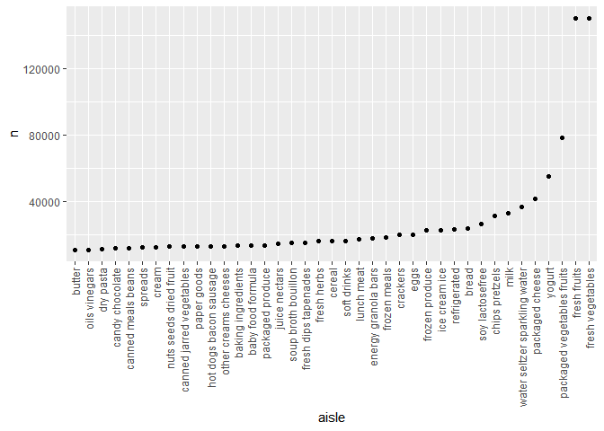
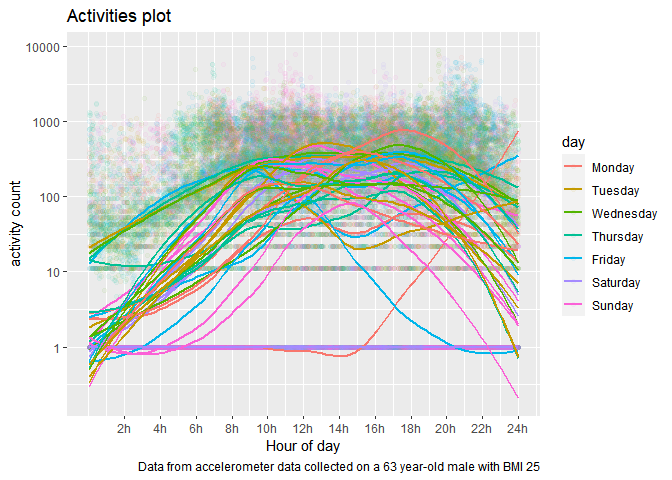
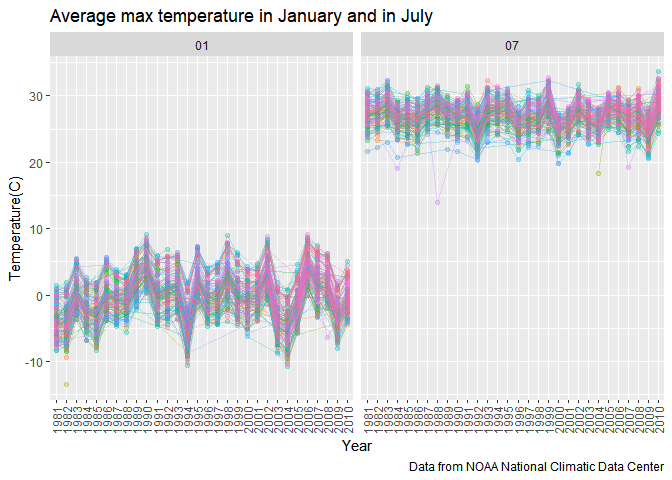
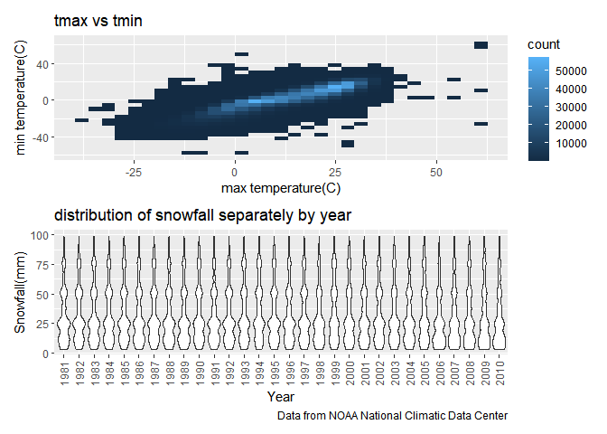

p8105\_hw3\_cy2588
================
Chufeng Yang
10/7/2020

I’m an R Markdown document\!

## Problem 1

``` r
library(tidyverse)
```

    ## -- Attaching packages ---------------------------------------------------------------------------------------------------------------------------------------------- tidyverse 1.3.0 --

    ## √ ggplot2 3.3.2     √ purrr   0.3.4
    ## √ tibble  3.0.3     √ dplyr   1.0.2
    ## √ tidyr   1.1.2     √ stringr 1.4.0
    ## √ readr   1.3.1     √ forcats 0.5.0

    ## -- Conflicts ------------------------------------------------------------------------------------------------------------------------------------------------- tidyverse_conflicts() --
    ## x dplyr::filter() masks stats::filter()
    ## x dplyr::lag()    masks stats::lag()

``` r
library(p8105.datasets)
library(patchwork)
data("instacart")
data("ny_noaa")
```

This dataset contains 1384617 rows and 15 columns.

Observations are the level of items in orders by user. There are user /
order variables – user ID, order ID, order day, and order hour. There
are also item variables – name, aisle, department, and some numeric
codes.

  - How many aisles are there, and which aisles are the most items
    ordered from?

<!-- end list -->

``` r
instacart %>% 
    count(aisle) %>% 
    arrange(desc(n))
```

    ## # A tibble: 134 x 2
    ##    aisle                              n
    ##    <chr>                          <int>
    ##  1 fresh vegetables              150609
    ##  2 fresh fruits                  150473
    ##  3 packaged vegetables fruits     78493
    ##  4 yogurt                         55240
    ##  5 packaged cheese                41699
    ##  6 water seltzer sparkling water  36617
    ##  7 milk                           32644
    ##  8 chips pretzels                 31269
    ##  9 soy lactosefree                26240
    ## 10 bread                          23635
    ## # ... with 124 more rows

There are 134 aisles, and fresh vegetables are the most items ordered
from.

  - Make a plot that shows the number of items ordered in each aisle,
    limiting this to aisles with more than 10000 items ordered. Arrange
    aisles sensibly, and organize your plot so others can read it.

<!-- end list -->

``` r
instacart %>% 
    count(aisle) %>% 
    filter(n > 10000) %>% 
    mutate(
        aisle = factor(aisle),
        aisle = fct_reorder(aisle, n)
    ) %>% 
    ggplot(aes(x = aisle, y = n)) + 
    geom_point() + 
    theme(axis.text.x = element_text(angle = 90, vjust = 0.5, hjust = 1))
```

<!-- -->

  - Make a table showing the three most popular items in each of the
    aisles “baking ingredients”, “dog food care”, and “packaged
    vegetables fruits”. Include the number of times each item is ordered
    in your table.

<!-- end list -->

``` r
instacart %>% 
    filter(aisle %in% c("baking ingredients", "dog food care", "packaged vegetables fruits")) %>% 
    group_by(aisle) %>% 
    count(product_name) %>% 
    mutate(rank = min_rank(desc(n))) %>% 
    filter(rank < 4) %>% 
    arrange(aisle, rank) %>% 
    knitr::kable()
```

| aisle                      | product\_name                                 |    n | rank |
| :------------------------- | :-------------------------------------------- | ---: | ---: |
| baking ingredients         | Light Brown Sugar                             |  499 |    1 |
| baking ingredients         | Pure Baking Soda                              |  387 |    2 |
| baking ingredients         | Cane Sugar                                    |  336 |    3 |
| dog food care              | Snack Sticks Chicken & Rice Recipe Dog Treats |   30 |    1 |
| dog food care              | Organix Chicken & Brown Rice Recipe           |   28 |    2 |
| dog food care              | Small Dog Biscuits                            |   26 |    3 |
| packaged vegetables fruits | Organic Baby Spinach                          | 9784 |    1 |
| packaged vegetables fruits | Organic Raspberries                           | 5546 |    2 |
| packaged vegetables fruits | Organic Blueberries                           | 4966 |    3 |

  - Make a table showing the mean hour of the day at which Pink Lady
    Apples and Coffee Ice Cream are ordered on each day of the week;
    format this table for human readers.

<!-- end list -->

``` r
instacart %>% 
    filter(product_name %in% c("Pink Lady Apples", "Coffee Ice Cream")) %>% 
    group_by(product_name, order_dow) %>% 
    summarize(mean_hour = mean(order_hour_of_day)) %>% 
    pivot_wider(
        names_from = order_dow,
        values_from = mean_hour
    ) %>% 
knitr::kable()
```

    ## `summarise()` regrouping output by 'product_name' (override with `.groups` argument)

| product\_name    |        0 |        1 |        2 |        3 |        4 |        5 |        6 |
| :--------------- | -------: | -------: | -------: | -------: | -------: | -------: | -------: |
| Coffee Ice Cream | 13.77419 | 14.31579 | 15.38095 | 15.31818 | 15.21739 | 12.26316 | 13.83333 |
| Pink Lady Apples | 13.44118 | 11.36000 | 11.70213 | 14.25000 | 11.55172 | 12.78431 | 11.93750 |

## Problem 2

Load, tidy, and otherwise wrangle the data.

``` r
accel_df = 
  read.csv("./data/accel_data.csv") %>% 
  janitor::clean_names() %>% 
  pivot_longer(
    activity_1:activity_1440,
    names_to = "minute",
    names_prefix = "activity.",
    values_to = "activity_count"
    ) %>% 
  mutate(
    weekday_vs_weekend = case_when(
      day %in% c("Saturday","Sunday") ~ "weekend",
      !(day %in% c("Saturday","Sunday")) ~ "weekday"
      )
    ) %>% 
  mutate(
    weekday_vs_weekend = as.factor(weekday_vs_weekend),
    day_id = as.factor(day_id), 
    week = as.factor(week),
    day = as.factor(day),
    minute = as.numeric(minute),
    activity_count = as.numeric(activity_count)
    )%>%
 mutate(day = forcats::fct_relevel(day,
                                   c("Monday","Tuesday","Wednesday","Thursday","Friday", "Saturday","Sunday"))
         ) %>% 
  relocate(day_id, week, weekday_vs_weekend) %>% 
  group_by(week) %>% 
  arrange(day, .by_group = TRUE)
```

    ## Warning in FUN(X[[i]], ...): strings not representable in native encoding will
    ## be translated to UTF-8

    ## Warning in FUN(X[[i]], ...): unable to translate '<U+00C4>' to native encoding

    ## Warning in FUN(X[[i]], ...): unable to translate '<U+00D6>' to native encoding

    ## Warning in FUN(X[[i]], ...): unable to translate '<U+00E4>' to native encoding

    ## Warning in FUN(X[[i]], ...): unable to translate '<U+00F6>' to native encoding

    ## Warning in FUN(X[[i]], ...): unable to translate '<U+00DF>' to native encoding

    ## Warning in FUN(X[[i]], ...): unable to translate '<U+00C6>' to native encoding

    ## Warning in FUN(X[[i]], ...): unable to translate '<U+00E6>' to native encoding

    ## Warning in FUN(X[[i]], ...): unable to translate '<U+00D8>' to native encoding

    ## Warning in FUN(X[[i]], ...): unable to translate '<U+00F8>' to native encoding

    ## Warning in FUN(X[[i]], ...): unable to translate '<U+00C5>' to native encoding

    ## Warning in FUN(X[[i]], ...): unable to translate '<U+00E5>' to native encoding

For now, in the final dataset, there are variables include day\_id,
week, weekday\_vs\_weekend, day, minute, activity\_count, with a total
of 50400 rows and 6 columns, there are 50400 observations.

Traditional analyses of accelerometer data focus on the total activity
over the day.Using your tidied dataset, aggregate accross minutes to
create a total activity variable for each day, and create a table
showing these totals. Are any trends apparent?

``` r
accel_df %>% 
  group_by(week,day) %>% 
  summarise(total_activity = sum(activity_count))%>% 
  pivot_wider(
    names_from = "day", 
    values_from = "total_activity")%>% 
knitr::kable()
```

    ## `summarise()` regrouping output by 'week' (override with `.groups` argument)

| week |    Monday |  Tuesday | Wednesday | Thursday |   Friday | Saturday | Sunday |
| :--- | --------: | -------: | --------: | -------: | -------: | -------: | -----: |
| 1    |  78828.07 | 307094.2 |    340115 | 355923.6 | 480542.6 |   376254 | 631105 |
| 2    | 295431.00 | 423245.0 |    440962 | 474048.0 | 568839.0 |   607175 | 422018 |
| 3    | 685910.00 | 381507.0 |    468869 | 371230.0 | 467420.0 |   382928 | 467052 |
| 4    | 409450.00 | 319568.0 |    434460 | 340291.0 | 154049.0 |     1440 | 260617 |
| 5    | 389080.00 | 367824.0 |    445366 | 549658.0 | 620860.0 |     1440 | 138421 |

It seems like activities from Tuesday to Friday are basically stable
during these 5 weeks, however, the activities are significant lower on
Saturday and Sunday in week 4 and 5, especially Saturday.

Accelerometer data allows the inspection activity over the course of the
day. Make a single-panel plot that shows the 24-hour activity time
courses for each day and use color to indicate day of the week. Describe
in words any patterns or conclusions you can make based on this graph.

``` r
accel_df %>% 
  group_by(day_id, day, week) %>% 
  ggplot(aes(x = minute, 
             y = activity_count, 
             color = day, 
             group = day_id)) + 
  geom_point(alpha = .05)+
  stat_smooth(se = F, 
              method = "loess") + 
  labs(title = "Activities plot",
       caption = "Data from accelerometer data collected on a 63 year-old male with BMI 25")+
  scale_x_continuous(name ="Hour of day" ,
                     breaks = c(seq(120,1440,120)), 
                     labels = c("2h", "4h", "6h", "8h", "10h", "12h","14h", "16h", "18h","20h", "22h", "24h")) +
  scale_y_continuous(name = "activity count", 
                      trans = "log10")
```

    ## `geom_smooth()` using formula 'y ~ x'

<!-- -->
Based on this graph, it’s seems that daily active time of this 63
year-old male is basically from around 8am to 10pm, and for weekday, his
activity counts would be higher and with longer active time.

## Problem 3

### 1

Do some data cleaning.

``` r
ny_noaa_df = 
  ny_noaa %>%
  separate(date, into = c("year","month","day")) %>%
  mutate_at(vars(year, month, day), as.factor) %>%
  mutate_at(vars(prcp, snow, tmax, tmin), as.numeric) %>%
  mutate(
    prcp = prcp / 10,
    tmax = tmax / 10,
    tmin = tmin / 10,
  )
skimr::skim_without_charts(ny_noaa_df)
```

|                                                  |              |
| :----------------------------------------------- | :----------- |
| Name                                             | ny\_noaa\_df |
| Number of rows                                   | 2595176      |
| Number of columns                                | 9            |
| \_\_\_\_\_\_\_\_\_\_\_\_\_\_\_\_\_\_\_\_\_\_\_   |              |
| Column type frequency:                           |              |
| character                                        | 1            |
| factor                                           | 3            |
| numeric                                          | 5            |
| \_\_\_\_\_\_\_\_\_\_\_\_\_\_\_\_\_\_\_\_\_\_\_\_ |              |
| Group variables                                  | None         |

Data summary

**Variable type: character**

| skim\_variable | n\_missing | complete\_rate | min | max | empty | n\_unique | whitespace |
| :------------- | ---------: | -------------: | --: | --: | ----: | --------: | ---------: |
| id             |          0 |              1 |  11 |  11 |     0 |       747 |          0 |

**Variable type: factor**

| skim\_variable | n\_missing | complete\_rate | ordered | n\_unique | top\_counts                                       |
| :------------- | ---------: | -------------: | :------ | --------: | :------------------------------------------------ |
| year           |          0 |              1 | FALSE   |        30 | 201: 159671, 200: 148721, 200: 122665, 200: 93249 |
| month          |          0 |              1 | FALSE   |        12 | 10: 224471, 12: 223603, 07: 220348, 08: 220100    |
| day            |          0 |              1 | FALSE   |        31 | 01: 85258, 02: 85258, 03: 85258, 04: 85258        |

**Variable type: numeric**

| skim\_variable | n\_missing | complete\_rate |  mean |     sd |     p0 |   p25 |  p50 |  p75 |  p100 |
| :------------- | ---------: | -------------: | ----: | -----: | -----: | ----: | ---: | ---: | ----: |
| prcp           |     145838 |           0.94 |  2.98 |   7.82 |    0.0 |   0.0 |  0.0 |  2.3 |  2286 |
| snow           |     381221 |           0.85 |  4.99 |  27.22 | \-13.0 |   0.0 |  0.0 |  0.0 | 10160 |
| snwd           |     591786 |           0.77 | 37.31 | 113.54 |    0.0 |   0.0 |  0.0 |  0.0 |  9195 |
| tmax           |    1134358 |           0.56 | 13.98 |  11.14 | \-38.9 |   5.0 | 15.0 | 23.3 |    60 |
| tmin           |    1134420 |           0.56 |  3.03 |  10.40 | \-59.4 | \-3.9 |  3.3 | 11.1 |    60 |

For snowfall, what are the most commonly observed values? Why?

``` r
ny_noaa_df %>%
  filter(snow != "NA") %>%
  count(snow) %>%
  filter(snow >= "0")%>%
  arrange(desc(n))
```

    ## # A tibble: 280 x 2
    ##     snow       n
    ##    <dbl>   <int>
    ##  1     0 2008508
    ##  2    25   31022
    ##  3    13   23095
    ##  4    51   18274
    ##  5    76   10173
    ##  6     8    9962
    ##  7     5    9748
    ##  8    38    9197
    ##  9     3    8790
    ## 10   102    6552
    ## # ... with 270 more rows

The most commonly observed value is 0, because It didn’t snow in most of
days.

### 2

Make a two-panel plot showing the average max temperature in January and
in July in each station across years. Is there any observable /
interpretable structure? Any outliers?

``` r
ny_noaa_df %>% 
  filter(month %in% c("01","07")) %>% 
  group_by(year, month, id) %>% 
  summarize(
    mean_tmax = mean(tmax),na.rm = T
  ) %>%
  drop_na() %>%
  ggplot(aes(x = year, 
             y = mean_tmax,
             color = id,
             group = id)) + 
  geom_point(alpha = 0.3) + 
  geom_path(alpha = 0.3) +
  facet_grid(~ month) +
  theme(legend.position = 'none',
        axis.text.x = element_text(angle = 90, vjust = 0.5, hjust = 1)) +
  labs(title = "Average max temperature in January and in July",
       caption = "Data from NOAA National Climatic Data Center",
       x = "Year",
       y = "Temperature(C)")
```

    ## `summarise()` regrouping output by 'year', 'month' (override with `.groups` argument)

<!-- -->
There’s a increasing of tmax in January from 1981 to 1993, but not
continue increase after that. The tmax of July are relatively stable.
There do have some outliers, Even if things are messy, are some stations
usually higher or lower than others across years? Are some years higher
or lower than you might expect?

### 3

plot 1: tmax vs tmin for the full dataset.

``` r
temp_plot = 
  ny_noaa_df %>%
   ggplot(aes(x = tmax, y = tmin)) + 
   geom_bin2d()+
   labs(title = "tmax vs tmin",
       x = "max temperature(C)",
       y = "min temperature(C)")
```

plot 2: the distribution of snowfall values greater than 0 and less than
100 separately by year.

``` r
snow_plot = 
  ny_noaa_df %>%
  filter(between(snow,1,100))%>%
  ggplot(aes(x= year, y = snow))+
  geom_violin()+
  theme(axis.text.x = element_text(angle = 90, vjust = 0.5, hjust = 1))+
   labs(title = "distribution of snowfall separately by year",
       caption = "Data from NOAA National Climatic Data Center",
       x = "Year",
       y = "Snowfall(mm)")
```

combine panels

``` r
temp_plot / snow_plot
```

<!-- -->
